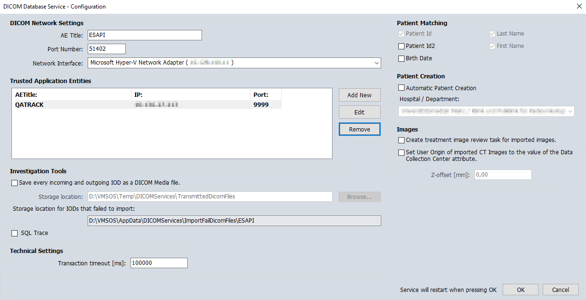

# pynetdicom_wrapper
A wrapper for [pynetdicom](https://pydicom.github.io/pynetdicom/stable/) to 
fetch DICOM RT-Images from Aria and store them in a directory for usage in QATrack+.

## Changelog:
v0.0.2: Added Option to get images by date. Created helper methods for creation of datasets.  
v0.0.1: Inital release.  

## Setup Instructions
There are three steps to take to be able to use the pynetdicom_wrapper script/module: 
Configure the Aria DB Daemon, install pynetdicom and pynetdicom_wrapper inside your 
QAtrack+ virtual environment and finally set up the QATrack+ test lists.

### Aria DICOM Service
In order to fetch DICOM images from Aria you first have to configure the 
DICOM Service in Aria to provide a "DB Service". There are in depth 
instructions in the [VarianApiBook Chapter 4](https://varianapis.github.io/VarianApiBook.pdf) 
which cover that topic. In most cases the software will probably be installed 
and you only have to add a "DB Service". AE title and port number can be 
chosen freely, the IPs are the ones from the Aria Server the DICOM service 
is running on and the QATrack+ server.



### Pynetdicom
To use the pynetdicom_wrapper you have to "pip install pynetdicom" 
(don't forget to activate your QATrack+ virtual environment). After that 
you can download the pynetdicom_wrapper folder from the repository and copy 
it to the site-packages (for example ~/venvs/qatrack31/lib/python3.10/site-packages/). 
Since the wrapper should allow for as few lines of code as possible in 
QATrack+ the connection to the Aria DB is hardcoded inside wrapper.py 
__init__() method (lines 33 and 34).
```Python
 32     # DICOM SCU/SCP config options
 33     self.local_conf = dset.AEConfig(aet='QATRACK', ip='192.186.1.1', port=9999)
 34     self.remote_conf = dset.AEConfig(aet='ESAPI', ip='192.168.1.2', port=51402)
```
(If you want to set the config on the fly you can do that when you ommit passing 
pat_id and plan_name when creating your PynetdicomWrapper instance. This way get_plan_uids
is not being called from __init__() and you can change local_conf, remote_conf and then call
get_plan_uids yourself.)

### QATrack+
First you have to make sure, your server firewall is accepting connections from the 
Aria DB Service on your 'local_conf.port'. Then, in QATrack+, you have to set up two 
string tests for the patient ID and the RTPlan name, one string-composite test 
for the code and some more composite/string-composite tests for the results. If 
you want to also have the option to start the download after you had time to 
set patient ID and plan name you can add an additional boolean test 
(see [testpack](./files/WL6X.tpk) in the files folder).

## Usage
When using the pynetdicom_wrapper you first create an instance of PynetdicomWrapper 
with the patient ID and the plan name as parameters. After that you call the 
.get_series() method with at least a Path to a (temporary) directory 
were the images can be stored in and the image type. The temporary directory 
can be created with the "tempfile" module from the python standard library 
(see example). The imagetype is in DICOM Tag (0008,0008) it should be either 
"ORIGINAL\PRIMARY\PORTAL" for normal portal images or "ORIGINAL\PRIMARY\PORTAL\ACQUIRED_DOSE" 
for portal dose images.

get_series() writes the files to the given directory (if anything is found) 
and returns the date+time string taken from the DICOM objects in case you 
want to write that to a test also.
If you also want to download the kV images from the series you can set ignore_kV to False.

If you want to get images from a specific date you can provide a datetime.date 
object via the keyword argument seriesdate. This can be used together with the 
[date test in QATrack+](https://docs.qatrackplus.com/en/stable/admin/qa/tests.html?highlight=date#type)

## Example
A simple test script utilizing the wrapper to grep the lastest Winston Lutz 
images and analyze them with pylinac would be something like this:
```Python
from pathlib import Path
from tempfile import TemporaryDirectory
from pylinac import WinstonLutz
from pynetdicom_wrapper import PynetdicomWrapper

temp_dir = TemporaryDirectory()
outputpath = Path(tempDir.name)

pndw = PynetdicomWrapper('QA_TB_WL', 'WL_10MV')
latest_date_time = pndw.get_series(outputpath, 'ORIGINAL\PRIMARY\PORTAL')

wl = WinstonLutz(outputpath)
wl.analyze(bb_size_mm=5)
wl.publish_pdf('mywl.pdf')
```

## Debug the connection
If you want to enable the pynetdicom debug logger, uncomment line 13: # debug_logger()

## Limitations
If there is more than one plan with the same ID in different series the script 
will not work as expected and A ValueError will be raised.
